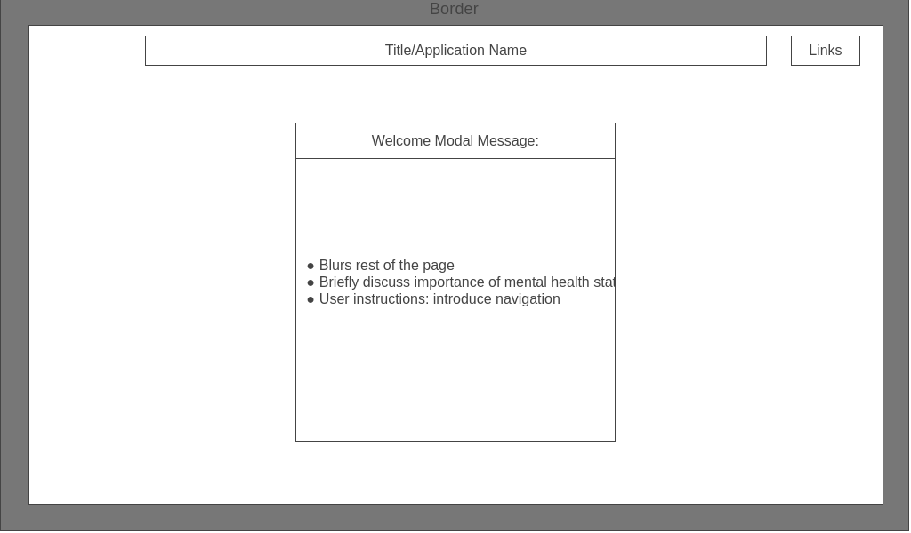
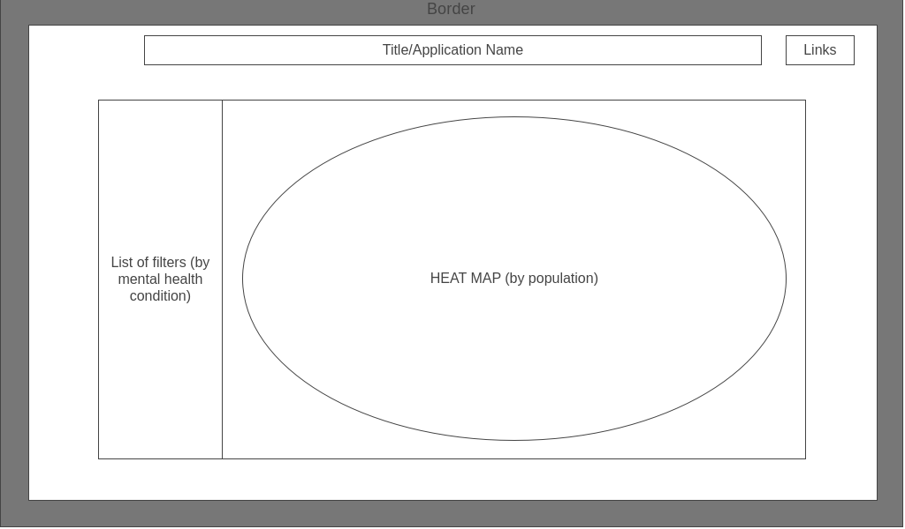

# State Stats
## Background
State Stats is a heat map tool that presents the user with various mental health statistics by state for the United States of America. Even with previous knowledge of statistics, interpretation of the figures and values are still masked by technical jargon. This is a tool that is designed to demystify mental health and spread awareness about serious issues that affect as much as roughly 27% of an entire population. Many data visualizations do not offer an intuitive interface for the average person to view aggregate data from clinical trials.

## Functionality & MVPs
In State Stats, users will be able to:

* view affected populations of mental health statistics through color schemes
* select different mental health statistics 
* toggle between viewing the state's raw population count for the selected condition and a proportional (percent) value for the selected condition
* zoom in and view state-specific data by clicking on individual states

In addition, this project will include:

* Definitive and conceptual context to explain the practical significance of different statistics
* A production README

## Wireframes

## Technologies, Libraries, APIs
* Vanilla Javascript
* D3.js library
* Data fetched locally from CSV files

## Implementation Timeline
* Friday Afternoon & Weekend: Research D3.js and implement U.S. map with individual states
* Monday: Refine CSV data and implement chloropeth feature
* Tuesday: Refine map, filter, and toggle styling
* Wednesday: Create modal for user instructions and refine webpage
* Thursday Morning: Finalize style and implement bonus charts